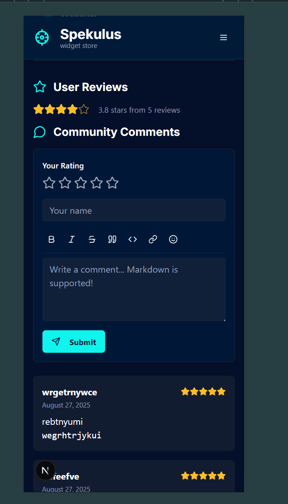
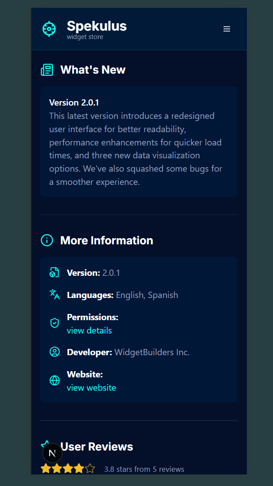

# Spekulus Widget Store

Welcome to Spekulus, a modern, feature-rich web application that serves as a curated marketplace for digital widgets. It's designed to provide a user-friendly interface for users to browse, discover, and interact with a variety of widgets for their personal dashboards or digital spaces.

The platform is both visually appealing and highly functional, incorporating cutting-edge technologies—including AI-powered recommendations and a community-driven ratings system—to deliver a personalized user experience. It also includes a comprehensive admin panel for easy management of the widget catalog and user-generated content.

---

## Screenshots

<br>

**Widget Detail Page**
*A clean and informative page showcasing individual widgets, their features, and user reviews.*


<br>

**Powerful Admin Panel**
*A comprehensive dashboard for managing widgets, comments, categories, FAQs, and site settings.*



---

## Key Features

- **Widget Discovery**: Browse a catalog of widgets, filterable by category.
- **Detailed Widget Pages**: View in-depth information for each widget, including features, version history, and user reviews.
- **Community Comments & Ratings**: Users can submit comments and a 1-5 star rating for each widget.
- **AI-Powered Recommendations**: Utilizes Genkit and Google AI to provide personalized widget suggestions.
- **Widget of the Day**: A dynamically selected widget is featured daily to promote discovery.
- **Featured Widgets Carousel**: A swipeable carousel on the homepage highlights popular or new widgets.
- **Responsive Design**: Fully responsive layout that works seamlessly across desktops, tablets, and mobile devices, including a "burger" menu for mobile navigation.
- **Admin Panel**: A secure interface for administrators to add, view, edit, and delete widgets, manage user-submitted comments, and manage FAQs and categories.

---

## Tech Stack

The project is built on a modern, robust, and scalable tech stack, prioritizing developer experience and performance.

- **Framework**: [Next.js](https://nextjs.org/) (v15) with the App Router
- **Language**: [TypeScript](https://www.typescriptlang.org/)
- **UI Library**: [React](https://reactjs.org/)
- **Styling**: [Tailwind CSS](https://tailwindcss.com/)
- **UI Components**: [shadcn/ui](https://ui.shadcn.com/)
- **Database**: [Appwrite](https://appwrite.io/) for community content and settings.
- **Generative AI**: [Genkit](https://firebase.google.com/docs/genkit) (with Google AI)
- **Forms**: [React Hook Form](https://react-hook-form.com/) with [Zod](https://zod.dev/) for validation.
- **Icons**: [Lucide React](https://lucide.dev/)

---

## Project Structure

The project follows a standard Next.js App Router structure. Below is an overview of the key directories:

```
spekulus-widget-store/
├── src/
│   ├── app/              # Main application folder (App Router)
│   │   ├── admin/        # Admin panel page
│   │   ├── widget/[id]/  # Dynamic route for widget detail pages
│   │   ├── page.tsx      # Home page
│   │   ├── actions.ts    # Server Actions for AI & database operations
│   │   └── data.ts       # Static data for widgets
│   │
│   ├── ai/               # Genkit flows and configuration
│   │
│   ├── components/       # Reusable React components
│   │   ├── ui/           # Core shadcn/ui components
│   │
│   └── lib/              # Utility functions and type definitions
│       ├── appwrite.ts   # Client-side Appwrite SDK
│       └── appwrite-server.ts # Server-side Appwrite SDK
│
├── public/               # Static assets
└── documentation.md      # In-depth project documentation
```

---

## Installation and Local Development

This section guides you through setting up the project on your local machine.

### Minimal Requirements
- **Node.js**: v18 or higher
- **npm** or **yarn**

### Step 1: Set up the Appwrite Backend
Before running the project, you must set up your Appwrite backend services. Detailed instructions for creating the necessary database and collections can be found in the `documentation.md` file.

### Step 2: Configure Local Environment

1.  **Clone the Repository**:
    ```bash
    git clone <your-repository-url>
    cd spekulus-widget-store
    ```

2.  **Create `.env` File**:
    *   Create a file named `.env` in the project root.
    *   Populate it with your Appwrite and Google AI API keys. You can find a complete example in `documentation.md`.

        ```env
        # Appwrite Configuration (Client & Server)
        NEXT_PUBLIC_APPWRITE_ENDPOINT="https://cloud.appwrite.io/v1"
        NEXT_PUBLIC_APPWRITE_PROJECT_ID="<YOUR_APPWRITE_PROJECT_ID>"
        # ... other Appwrite collection IDs

        # Google AI Configuration (Server-Side)
        GEMINI_API_KEY="<YOUR_GOOGLE_AI_API_KEY>"

        # Appwrite API Key (Server-Side)
        APPWRITE_API_KEY="<YOUR_APPWRITE_SERVER_API_KEY>"
        ```

### Step 3: Install Dependencies and Run

1.  **Install Packages**:
    ```bash
    npm install
    ```

2.  **Run the Development Servers**:
    *   Start the Next.js application:
        ```bash
        npm run dev
        ```
    *   In a new terminal, start the Genkit development server:
        ```bash
        npm run genkit:watch
        ```

The application will be available at `http://localhost:3000`.
